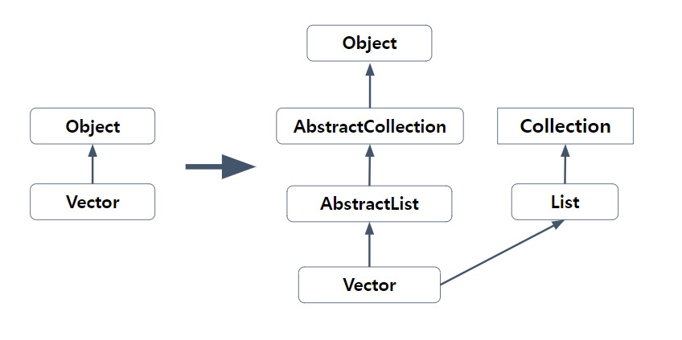
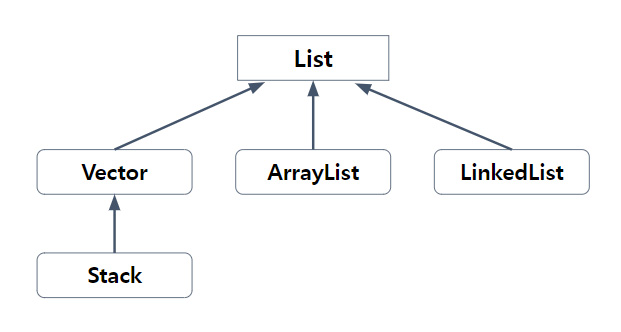
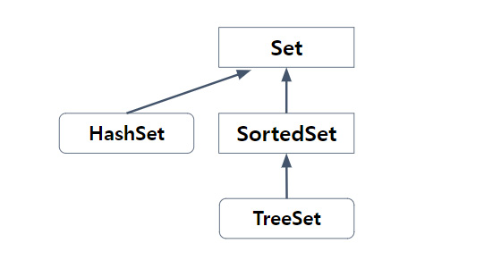
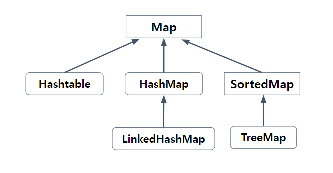

# 컬렉션 프레임워크 1-1

## 1. 컬렉션 프레임워크(Collection Framework)
: '데이터 군을 저장하는 클래스들을 표준화한 설계'
  **컬렉션(Collection)** = 다수의 데이터·데이터 그룹, **프레임워크(Framework)** = 표준화된 프로그램 방식

### 1.1 컬렉션 프레임워크의 핵심 인터페이스
: 컬렉션 프레임워크에서는 컬렉션 데이터 그룹을 크게 3가지 타입이 존재한다고 인식하고 3개의 인터페이스를 정의
  그리고 **인터페이스 List와 Set**의 공통된 부분을 다시 뽑아서 새로운 인터페이스인 Collection을 추가로 정의함.
  List와 Set을 구현한 컬렉션 클래스들은 서로 많은 공통부분이 있어서 공통된 부분을 다시 뽑아 Collection인터페이스를 정의할 수 있었지만,
**Map인터페이스**는 이들과 전혀 다른 형태로 컬렉션을 다루기 때문에 같은 상속계층도에 포함되지 못함.

| 인터페이스 | 특징                                                                                                                                                                 |
|:-----:|--------------------------------------------------------------------------------------------------------------------------------------------------------------------|
| **List**  | 순서가 있는 데이터의 집합. 데이터의 중복을 허용한다. Ex) 대기자 명단 
구현클래스 : ArrayList, LinkedList, Stack, Vector 등                                                                   |
|  **Set**  | 순서를 유지하지 않는 데이터의 집합. 데이터의 중복을 허용하지 않는다. Ex) 양의 정수집합, 소수의 집합 
구현클래스 : HashSet, TreeSet 등                                                                     |
|  **Map**  | 키(Key)와 값(value)의 쌍(pair)으로 이루어진 데이터의 집합 순서는 유지되지 않으며, 키의 중복을 허용하지 않고, 값은 중복 허용 Ex) 우편번호, 지역번호(전화번호) 
구현클래스 : HashMap, TreeMap, Hashtable, Properties 등 |

** **키(Key)** 란, 데이터 집합 중에서 어떤 값(value)을 찾는데 열쇠(key)가 된다는 의미에서 붙여진 이름. 그래서 키는 중복을 허용하지 않음

 

#### Collection인터페이스

| 메서드                                                              | 설명                                                                                                            |
|------------------------------------------------------------------|---------------------------------------------------------------------------------------------------------------|
| boolean add(Object o) boolean addAll(Collection c)           | 지정된 객체(o) 또는 Collection(c)의 객체들을 Collection에 추가                                                               |
| void clear()                                                     | Collection의 모든 객체를 삭제                                                                                         |
| boolean contains(Object o) boolean containsAll(Collection c) | 지정된 객체(o) 또는 Collection(c)의 객체들을 Collection에 포함되어 있는지 확인                                                      |
| boolean equals(Object o)                                         | 동일한 Collection인지 비교                                                                                           |
| int hashCode()                                                   | Collection의 hash code를 반환                                                                                     |
| boolean isEmpty()                                                | Collection이 비어있는지 확인                                                                                          |
| Iterator iterator()                                              | Collection의 Iterator를 얻어서 반환                                                                                  |
| boolean remove(Object o)                                         | 지정된 객체를 삭제                                                                                                    |
| boolean removeAll(Collection c)                                  | 지정된 Collection에 포함된 객체들을 삭제                                                                                   |
| boolean retainAll(Collection c)                                  | 지정된 Collection에 포함된 객체만을 남기고 다른 객체들은 Collection에서 삭제 이 작업으로 인해 Collection에 변화가 있으면 true, 그렇지 않으면 false 반환 |
| int size()                                                       | Collection에 저장된 객체의 개수를 반환                                                                                    |
| Object[] toArray()                                               | Collection에 저장된 객체를 객체배열(Object[])로 반환                                                                        |
| Object[] toArray(Object[] a)                                     | 지정된 배열에 Collection의 객체를 저장해서 반환                                                                               |

Collection 인터페이스는 컬렉션 클래스에 저장된 데이터를 읽고, 추가하고 삭제하는 등 컬렉션을 다루는데 가장 기본적인 메서드를 정의하고 있다.

 

#### List인터페이스
: List인터페이스는 **중복을 허용하면서 저장순서가 유지**되는 컬렉션을 구현하는데 사용

| 메서드                                                                             | 설명                                                   |
|---------------------------------------------------------------------------------|------------------------------------------------------|
| void add(int index, Object element) boolean addAll(int index, Collection c) | 지정된 위치(index)에 객체(element) 또는 컬렉션에 포함된 객체들을 추가       |
| Object get(int index)                                                           | 지정된 위치(index)에 있는 객체를 반환                             |
| int index(Object o)                                                             | 지정된 객체의 위치(index)를 반환 (List의 첫번째 요소부터 순방향으로 찾는다) |
| int lastIndexObject(Object o)                                                   | 지정된 객체의 위치(index)를 반환 (List의 마지막 요소부터 역방향으로 찾는다) |
| ListIterator listIterator() ListIterator listIterator(int index)            | List의 객체에 접근할 수 있는 ListIterator를 반환                  |
| Object remove(int index)                                                        | 지정된 위치(index)에 있는 객체를 삭제하고 삭제된 객체를 반환                |
| Object set(int index, Object element)                                           | 지정된 위치(index)에 있는 객체를(element)를 저장                   |
| void sort(Comparator c)                                                         | 지정된 비교자(comparator)로 List를 정렬                        |
| List subList(int fromIndex, int toIndex)                                        | 지정된 범위(fromIndex부터 toIndex)에 있는 객체를 반환               |

 

#### Set인터페이스
: Set인터페이스는 **중복을 허용하지 않고 저장순서가 유지되지 않는** 컬렉션 클래스를 구현하는데 사용
 Set인터페이스를 구현한 클래스로는 HashSet, TreeSet 등이 있다.

 

#### Map인터페이스
: Map인터페이스는 **키(key)와 값(value)을 하나의 쌍으로 묶어서 저장**하는 컬렉션 클래스를 구현하는데 사용
  **키는 중복될 수 없지만 값은 중복을 허용**한다.
  기존에 저장된 데이터와 중복된 키와 값을 저장하면 기존의 값은 없어지고 마지막에 저장된 값이 남게 된다.
  Map인터페이스를 구현한 클래스로는 Hashtable, HashMap, LinkedHashMap, SortedMap, TreeMap 등

| 메서드                                  | 설명                                                     |
|--------------------------------------|--------------------------------------------------------|
| void clear()                         | Map의 모든 객체를 삭제                                         |
| boolean containsKey(Object key)      | 지정된 key객체와 일치하는 Map의 key객체가 있는지 확인                     |
| boolean containsValue(Object value)  | 지정된 value객체와 일치하는 Map의 value객체가 있는지 확인                 |
| Set entrySet()                       | Map에 저장되어 있는 key-value쌍을 Map.Entry타입의 객체로 저장한 Set으로 반환 |
| boolean equals(Object o)             | 동일한 Map인지 비교                                           |
| Object get(Object key)               | 지정한 key객체에 대응하는 value객체를 찾아서 반환                        |
| int hashCode()                       | 해시코드를 반환                                               |
| boolean isEmpty()                    | Map이 비어있는지 확인                                          |
| Set keySet()                         | Map에 저장된 모든 key객체를 반환                                  |
| Object put(Object key, Object value) | Map에 value객체를 key객체에 연결(mapping)하여 저장                  |
| void putAll(Map t)                   | 지정된 Map의 모든 key-value쌍을 추가                             |
| Object remove(Object key)            | 지정한 key객체와 일치하는 key-value객체를 삭제                        |
| int size()                           | Map에 저장된 key-value쌍의 개수를 반환                            |
| Collection values()                  | Map에 저장된 모든 value객체를 반환                                |

#### Map.Entry인터페이스
: Map.Entry인터페이스는 Map인터페이스의 내부 인터페이스이다. 내부클래스와 같이 인터페이스도 인터페이스 안에 인터페이스를 정의하는 내부 인터페이스를 정의 가능

| 메서드                           | 설명                         |
|-------------------------------|----------------------------|
| boolean equals(Object o)      | 동일한 Entry인지 비교             |
| Object getKey()               | Entry의 key객체를 반환           |
| Object getValue()             | Entry의 value객체를 반환         |
| int hashCode()                | Entry의 해시코드를 반환            |
| Object setValue(Object value) | Entry의 value객체를 지정된 객체로 바꿈 |

### 1.2 ArrayList
: ArrayList는 컬렉션 프레임워크에서 가장 많이 사용되는 컬렉션 클래스.
  List인터페이스를 구현하기 때문에 **데이터의 저장순서가 유지되고 중복을 허용**한다.
  ArrayList는 **Object배열을 이용해서 데이터를 순차적으로 저장**한다. 배열에 더이상 저장공간이 없으면
보다 큰 새로운 배열을 생성해서 기존의 배열에 저장된 내용을 새로운 배열로 복사한 다음에 저장된다.

| 메서드                                      | 설명                                                 |
|------------------------------------------|----------------------------------------------------|
| ArrayList()                              | 크기가 10인 ArrayList를 생성                              |
| ArrayList(Collection c)                  | 주어진 컬렉션이 저장된 ArrayList를 생성                         |
| ArrayList(int initialCapacity)           | 지정된 초기용량을 갖는 ArrayList를 생성                         |
| boolean add(Object o)                    | ArrayList의 마지막에 객체를 추가, 성공하면 true                  |
| void add(int index, Object element)      | 지정된 위치(index)에 객체 저장                               |
| boolean addAll(Collection c)             | 주어진 컬렉션의 모든 객체 저장                                  |
| boolean addAll(int index, Collection c)  | 지정된 위치부터 주어진 컬렉션의 모든 객체 저장                         |
| void clear()                             | ArrayList를 완전히 비움                                  |
| Object clone()                           | ArrayList를 복제                                      |
| boolean contains(Object o)               | 지정된 객체(o)가 ArrayList에 포함되어 있는지 확인                  |
| void ensureCapacity(int minCapacity)     | ArrayList의 용량이 최소한 minCapacity가 되도록 함              |
| Object get(int index)                    | 지정된 위치(index)에 저장된 객체 반환                           |
| int indexOf(Ojbect o)                    | 지정된 객체가 저장된 위치를 찾아 반환                              |
| boolean isEmpty()                        | ArrayList가 비어있는지 확인                                |
| Iterator iterator()                      | ArrayList의 Iterator객체를 반환                          |
| int lastIndexOf(Object)                  | 객체(o)가 저장된 위치를 끝부터 역방향으로 검색해서 반환                   |
| ListIterator listIterator()              | ArrayList의 ListIterator를 반환                        |
| ListIterator listIterator(int index)     | ArrayList의 지정된 위치부터 시작하는 ListIterator를 반환          |
| Object remove(int index)                 | 지정된 위치에 있는 객체 제거                                   |
| boolean remove(Object o)                 | 지정한 객체를 제거(성공하면 true, 실패하면 false)                  |
| boolean removeAll(Collection o)          | 지정한 컬렉션에 저장된 것과 동일한 객체들을 ArrayList에서 제거            |
| boolean retainAll(Collection o)          | ArrayList에 저장된 객체 중에서 주어진 컬렉션과 공통된 것들만 남기고 나머지는 삭제 |
| Object set(int index, Object element)    | 주어진 객체(element)를 지정된 위치에 저장                        |
| int size()                               | ArrayList에 저장된 객체의 개수를 반환                          |
| void sort(Comparator c)                  | 지정된 정렬기준(c)으로 ArrayList를 정렬                        |
| List subList(int fromIndex, int toIndex) | fromIndex부터 toIndex 사이에 저장된 객체를 반환                 |
| Object[] toArray()                       | ArrayList에 저장된 모든 객체들을 객체배열로 반환                    |
| Object[] toArray(Object[] a)             | ArrayList에 저장된 모든 객체들을 객체배열 a에 담아 반환               |
| void trimToSize()                        | 용량을 크기에 맞게 줄임(빈 공간 삭제)                             |

### 1.3 LinkedList

- 배열의 단점
1. **크기를 변경할 수 없다.**
   - 크기를 변경할 수 없으므로 새로운 배열을 생성해서 데이터를 복사해야한다.
   - 실행속도를 향상시키기 위해서는 충분히 큰 크기의 배열을 생성해야 하므로 메모리가 낭비된다.
2. **비순차적인 데이터의 추가 또는 삭제에 시간이 많이 걸린다.**
   - 차례대로 데이터를 추가하고 마지막에서부터 데이터를 삭제하는 것은 빠르지만,
   - 배열의 중간에 데이터를 추가하려면, 빈자리를 만들기 위해 다른 데이터들을 복사해서 이동해야 한다.

→ 이러한 배열의 단점을 보완하기 위해 **링크드 리스트(LinkedList)** 라는 자료구조가 고안됨.
  배열은 모든 데이터가 연속적으로 존재하지만 링크드 리스트는 불연속적으로 존재하는 데이터를 서로 연결(list)한 형태로 구성됨

링크드 리스트는 이동방향이 단방향이기 때문에 다음 요소에 대한 접근은 쉽지만 이전요소에 대한 접근은 어렵다.
  이 점을 보완한 것이 **더블 링크드 리스트(이중 연결리스트, doubly linked list)** 이다.
  더블 링크드 리스트는 단순히 링크드 리스트에 참조변수를 하나 더 추가하여 다음 요소에 대한 참조뿐 아니라 이전 요소에 대한 참조가 가능하게 했을 뿐, 그 외에는 링크드 리스트와 같다.

| 생성자 또는 메서드                               | 설명                                                                          |
|------------------------------------------|-----------------------------------------------------------------------------|
| LinkedList()                             | LinkedLIst객체를 생성                                                            |
| LinkedList(Collection c)                 | 주어진 컬렉션을 포함하는 LinkedList객체를 생성                                              |
| boolean add(Object o)                    | 지정된 객체(o)를 LinkedList의 끝에 추가. 저장에 성공하면 true, 실패하면 false                     |
| void add(int index, Object element)      | 지정된 위치(index)에 객체(element)를 추가                                              |
| boolean addAll(Collection c)             | 주어진 컬렉션에 포함된 모든 요소를 LinkedList의 끝에 추가. 성공하면 true, 실패하면 false                |
| boolean addAll(int index, Collection c)  | 지정된 위치(index)에 주어진 컬렉션에 포함된 모든 요소를 LinkedList의 끝에 추가. 성공하면 true, 실패하면 false |
| void clear()                             | LinkedList의 모든 요소를 삭제                                                       |
| boolean contains(Object o)               | 지정된 객체가 LinkdeList에 포함되었는지 알려줌                                              |
| boolean containsAll(Collection c)        | 지정된 컬렉션의 모든 요소가 포함되었는지 알려줌                                                  |
| Object get(int index)                    | 지정된 위치의 객체를 반환                                                              |
| int indexOf(Object o)                    | 지정된 객체가 저장된 위치(앞에서 몇 번째)를 반환                                                |
| boolean isEmpty()                        | LinkedList가 비어있는지 알려줌. 비어있으면 true                                           |
| Iterator iterator()                      | Iterator를 반환                                                                |
| int lastIndexOf(Object o)                | 지정된 객체의 위치를 반환(끝부터 역순검색)                                                    |
| ListIterator listIterator()              | ListIterator를 반환                                                            |
| ListIterator listIterator(int index)     | 지정된 위치에서부터 시작하는 ListIterator를 반환                                            |
| Object remove(int index)                 | 지정된 위치의 객체를 LinkedList에서 제거                                                 |
| boolean remove(Object o)                 | 지정된 객체를 LinkedList에서 제거. 성공하면 true, 실패하면 false                              |
| boolean removeAll(Collection c)          | 지정된 컬렉션의 요소와 일치하는 요소를 모두 삭제                                                 |
| boolean retainAll(Collection c)          | 지정된 컬렉션의 모든 요소가 포함되어 있는지 확인                                                 |
| Object set(int index, Object element)    | 지정된 위치의 객체를 주어진 객체로 바꿈                                                      |
| int size()                               | LinkedList에 저장된 객체의 수를 반환                                                   |
| List subList(int fromIndex, int toIndex) | LinkedList의 일부를 List로 반환                                                    |
| Object[] toArray()                       | LinkdeList에 저장된 객체를 배열로 반환                                                  |
| Object[] toArray(Object[] a)             | LinkdeList에 저장된 객체를 주어진 배열에 저장하여 반환                                         |
| Object element()                         | LinkedList의 첫 번째 요소를 반환                                                     |
| boolean offer(Object o)                  | 지정된 객체(o)를 LinkedList의 끝에 추가. 성공하면 true, 실패하면 false                         |
| Object peek()                            | LinkedList의 첫 번째 요소를 반환                                                     |
| Object poll()                            | LinkedList의 첫 번째 요소를 반환. LinkedList에서는 제거                                   |
| Object remove()                          | LinkedList의 첫 번째 요소를 제거                                                     |
| void addFirst(Object o)                  | LinkedList의 맨 앞에 객체(o)를 추가                                                  |
| void addLast(Object o)                   | LinkedList의 맨 끝에 객체(o)를 추가                                                  |
| Iterator descendingIterator()            | 역순으로 조회하기 위한 DescendingIterator를 반환                                         |
| Object getFirst()                        | LinkedList의 첫번째 요소를 반환                                                      |
| Object getLast()                         | LinkedList의 마지막 요소를 반환                                                      |
| boolean offerFirst()                     | LinkedList의 맨 앞에 객체(o)를 추가. 성공하면 true                                       |
| boolean offerLast()                      | LinkedList의 맨 끝에 객체(o)를 추가. 성공하면 true                                       |
| Object peekFirst()                       | LinkedList의 첫번째 요소를 반환                                                      |
| Object peekLast()                        | LinkedList의 마지막 요소를 반환                                                      |
| Object pollFirst()                       | LinkedList의 첫번째 요소를 반환하면서 제거                                                |
| Object pollLast()                        | LinkedList의 마지막 요소를 반환히면서 제거                                                |
| Object pop()                             | removeFirst와 동일                                                             |
| void push(Object o)                      | addFirst와 동일                                                                |
| Object removeFirst()                     | LinkedList의 첫번째 요소를 제거                                                      |
| Object removeLast()                      | LinkedList의 마지막 요소를 제거                                                      |
| boolean removeFirstOccurrence(Object o)  | LinkedList에서 첫번째로 일치하는 객체를 제거                                               |
| boolean removeLasttOccurrence(Object o)  | LinkedList에서 마지막으로 일치하는 객체를 제거                                              |

** ArrayList와 LinkedList의 비교

| 컬렉션           | 읽기(접근시간) | 추가 / 삭제 | 비고                               |
|---------------|----------|---------|----------------------------------|
| **ArrayList** | 빠르다      | 느리다     | 순차적인 추가삭제는 더 빠름 비효율적인 메모리 사용 |
| **LinkedList**    | 느리다      | 빠르다     | 데이터가 많을수록 접근성이 떨어짐               |
