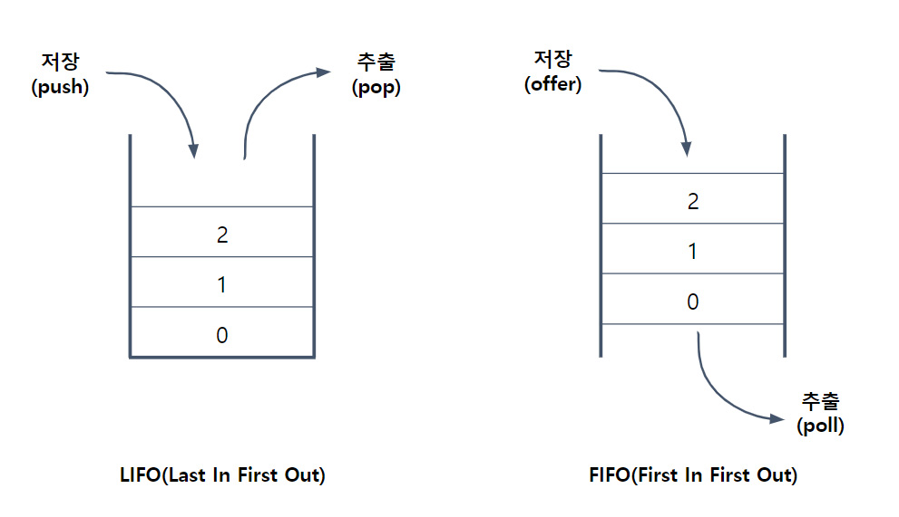
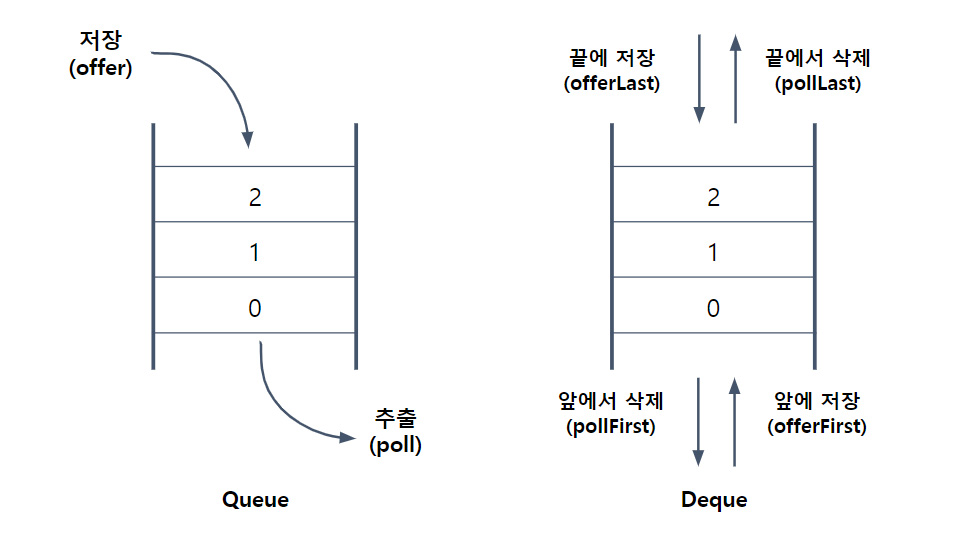

# 컬렉션 프레임워크 1-2

### 1.4 Stack과 Queue
- **스택(Stack)** : 마지막에 저장한 데이터를 가장 먼저 꺼내게 되는 LIFO(Last In First Out)구조
  - Ex) 동전통과 같은 구조, 양 옆과 바닥이 막혀 있어서 한 방향으로만 뺄 수 있는 구조
  - **ArrayList**와 같은 배열 기반의 컬렉션 클래스가 적합
- **큐(Queue)** : 처음에 저장한 데이터를 가장 먼저 꺼내게 되는 FIFO(First In First Out)구조
  - 양 옆만 막혀있고 위아래로 뚫려있어서 한 방향으로는 넣고 한 방향으로는 빼는 파이프와 같은 구조
  - 데이터의 추가/삭제가 쉬운 **LinkedList**로 구현하는 것이 적합



#### Stack의 메서드
| 메서드                      | 설명                                                                                      |
|--------------------------|-----------------------------------------------------------------------------------------|
| boolean empty()          | Stack이 비어있는지 알려준다                                                                       |
| Object peek()            | Stack의 맨 위에 저장된 객체를 반환. pop()과 달리 Stack에서 객체를 꺼내지 않음<br/>(비었을 때는 EmptyStackException발생) |
| Object pop()             | Stack의 맨 위에 저장된 객체를 꺼낸다.<br/>(비었을 때는 EmptyStackException발생)                             |
| Object push(Object item) | Stack에 객체(item)를 저장                                                                     |
| int search(Object o)     | Stack에서 주어진 객체(o)를 찾아서 그 위치를 반환. 못 찾으면 -1을 반환<br/>(배열과 달리 위치는 0이 아닌 1부터 시작)             |


#### Queue의 메서드
| 메서드                     | 설명                                                              |
|-------------------------|-----------------------------------------------------------------|
| boolean add(Object o)   | 지정된 객체를 Queue에 추가한다.                                            |
| Object remove()         | Queue에서 객체를 꺼내 반환. 비어있으면 NoSuchElementException 발생              |
| Object element()        | 삭제없이 요소를 읽어온다. peek와 달리 Queue가 비어있을 때 NoSuchElementException 발생 |
| boolean offer(Object o) | Queue에 객체를 저장. 성공하면 true, 실패하면 false 반환                         |
| Object poll()           | Queue에서 객체를 꺼내서 반환. 비어있으면 null 반환                               |
| Object peek()           | 삭제없이 요소를 읽어온다. Queue가 비어있으면 null 반환                             |

```
Stack st = new Stack();
Queue q = new LinkedList();   // Queue인터페이스의 구현체인 LinkedList를 사용

st.push("0");
st.push("1");
st.push("2");

q.offer("0");
q.offer("1");
q.offer("2");

System.out.println("= Stack =");
while(!st.empty()) {
  System.out.println(st.pop());
}

System.out.println("= Queue =");
while(!q.isEmpty()) {
  System.out.println(q.poll());
}

---------------------------
= Stack =
2
1
0
= Queue =
0
1
2
```

#### 스택과 큐의 활용
- 스택의 활용 : 수식계산, 수식 괄호 검사, 워드프로세서의 undo/redo, 웹브라우저의 뒤로/앞으로
- 큐의 활용 : 최근 사용문서, 인쇄 작업 대기목록, 버퍼(buffer)


#### PriorityQueue
: Queue인터페이스의 구현체 중 하나로, 저장한 순서에 관계없이 우선순위(priority)가 높은 것부터 꺼내게 된다. 그리고 null은 저장할 수 없다. (Null 저장시 NullPointerException 발생)
<br> **PriorityQueue**는 저장공간으로 배열을 사용하며, 각 요소를 '**힙(heap)**'이라는 자료구조의 형태로 저장한다.
힙은 이진 트리의 한 종류로 가장 큰 값이나 가장 작은 값을 빠르게 찾을 수 있다.

```
Queue pq = new PriorityQueue();
pq.offer(3);
pq.offer(1);
pq.offer(5);
pq.offer(2);
pq.offer(4);
System.out.println(pq); // pq의 내부 배열을 출력

Object obj = null;

// PriorityQueue에 저장된 요소를 하나씩 꺼낸다.
while((obj = pq.poll()) != null)
  System.out.println(obj);
  
-------------------
[1, 2, 5, 3, 4]
1
2
3
4
5
// 힙의 자료구조의 형태로 저장되었기 때문에 저장한 순서와 다르게 저장되어 출력됨
```

#### Deque(Double-Ended Queue)
: Queue의 변형으로 한 쪽 끝으로만 추가/삭제할 수 있는 Queue와 달리, **Deque**(**덱**, 또는 디큐)은 **양쪽 끝에 추가/삭제가 가능**하다.
<br> Deque의 조상은 Queue이며, 구현체로는 ArrayDeque와 LinkedList 등이 있다.



| Deque       |  Queue  | Stack  |
|:------------|:-------:|:------:|
| offerLast() | offer() | push() |
| pollLast()  |    -    | pop()  |
| pollFirst() | poll()  |   -    |
| peekFirst() | peek()  |        |
| peekLast()  |    -    | peek() |