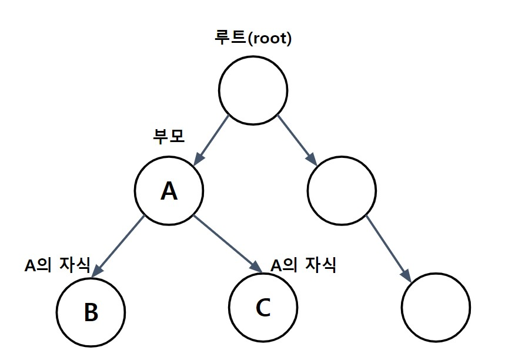

# 컬렉션 프레임워크 1-4

### 1.7 Comparator와 Comparable
: Comparartor와 Comparable은 모두 인터페이스로 컬렉션을 정렬하는데 필요한 메서드를 정의하고 있으며,
Comparable을 구현하고 있는 클래스들은 같은 타입의 인스턴스끼리 서로 비교할 수 있는 클래스들,
주로 Integer와 같은 wrapper클래스와 String, Date, File과 같은 것들이며
기본적으로 오름차순, 즉 작은 값에서부터 큰 값의 순으로 정렬되도록 구현되어 있다.
<br>그래서 Comparable을 구현한 클래스는 정렬이 가능하다는 것을 의미한다.

```
public interface Comparator {
    intn compare(Object o1, Object o2);
    boolean equals(Object obj);
}

public interface Comparable {
    public int compareTo(Object o);
}
```

compare()와 compareTo()는 선언형태와 이름이 약간 다를 뿐 두 객체를 비교한다는 같은 기능을 목적으로 고안된 것.
compareTo()의 반환값은 int이지만 실제로는 비교하는 두 객체가 같으면 0, 비교하는 값보다 작으면 음수, 크면 양수를 반환하도록 구현.
compare()도 객체를 비교해서 음수, 0, 양수 중의 하나를 반환하도록 구현해야 한다.

- Comparable : 기본 정렬 기준을 구현하는데 사용
- Comparator : 기본 정렬 기준 외에 다른 기준으로 정렬하고자 할 때 사용


### 1.8 HashSet
: **HashSet**은 Set인터페이스를 구현한 가장 대표적인 컬렉션이며, Set인터페이스의 특징대로 HashSet은 중복된 요소를 저장하지 않음.
<br> HashSet의 특징을 이용한다면 컬렉션 내의 중복 요소들을 쉽게 제거할 수 있다.
<br>
<br>
ArrayList와 같이 List인터페이스를 구현한 컬렉션과 달리 HashSet은 저장순서를 유지하지 않기 때문에 **저장순서를 유지**하고자 한다면 **LinkedHashSet**을 사용해야 한다.

- **HashSet**의 메서드

| 생성자 또는 메서드                                     | 설명                                               |
|------------------------------------------------|--------------------------------------------------|
| HashSet()                                      | HashSet객체를 생성                                    |
| HashSet(Collection c)                          | 주어진 컬렉션을 포함하는 HashSet객체를 생성                      |
| HashSet(int initialCapacity)                   | 주어진 값을 초기용량으로 하는 HashSet객체를 생성                   |
| HashSet(int initialCapacity, float loadFactor) | 초기용량과 load factor를 지정하는 생성자                      |
| boolean add(Object o)                          | 새로운 객체를 저장                                       |
| boolean addAll(Collection c)                   | 주어진 컬렉션에 저장된 모든 객체들을 추가(합집합)                     |
| void clear()                                   | 저장된 모든 객체를 삭제                                    |
| Object clone()                                 | HashSet을 복제해서 반환(얕은 복사)                          |
| boolean contains(Object o)                     | 지정된 객체를 포함하고 있는지 알려줌                             |
| boolean containsAll(Collection c)              | 주어진 컬렉션에 저장된 모든 객체들을 포함하고 있는지 알려줌                |
| boolean isEmpty()                              | HashSet이 비어있는지 알려줌                               |
| Iterator iterator()                            | Iterator를 반환                                     |
| boolean remove(Object o)                       | 지정된 객체를 HashSet에서 삭제(성공하면 true, 실패하면 false)      |
| boolean removeAll(Collection c)                | 주어진 컬렉션에 저장된 모든 객체와 동일한 것들을 HashSet에서 모두 삭제(차집합) |
| boolean retainAll(Collection c)                | 주어진 컬렉션에 저장된 객체와 동일한 것만 남기고 삭제(교집합)              |
| int size()                                     | 저장된 객체의 개수를 반환                                   |
| Object[] toArray()                             | 저장된 객체들을 객체배열의 형태로 반환                            |
| Object[] toArray(Object[] a)                   | 저장된 객체들을 주어진 객체배열(a)에 담는다                        |


##### 오버라이딩을 통해 작성된 hashCode()의 조건
1. 실행 중인 애플리케이션 내의 동일한 객체에 대해서 여러 번 hashCode()를 호출해도 동일한 int값을 반환해야 한다.
<br>    하지만, 실행시마다 동일한 int값을 반환할 필요는 없다.(단 equals메서드의 구현에 사용된 멤버변수의 값이 바뀌지 않았다고 가정함.)
2. equals메서드를 이용한 비교에 의해서 true를 얻은 두 객체에 대해 각각 hashCode()를 호출해서 얻은 결과는 반드시 같아야 한다.
<br>    
3. equals메서드를 호출했을 때 false를 반환하는 두 객체는 hashCode() 호출에 대해 같은 int값을 반환하는 경우가 있어도 괜찮지만,
<br>    해싱(hashing)을 사용하는 컬렉션의 성능을 향상시키기 위해서는 다른 int값을 반환하는 것이 좋다.


### 1.9 TreeSet
: **TreeSet**은 이진 검색 트리(binary search tree)라는 자료구조의 형태로 데이터를 저장하는 컬렉션 클래스이다.
이진 검색 트리는 **정렬, 검색, 범위검색**에 높은 성능을 보이는 자료구조이며 TreeSet은 이진 검색 트리의 성능을 향상시킨 '레드-블랙 트리(Red-Black tree)'로 구현됨
<br> 그리고 Set인터페이스를 구현했으므로 **중복된 데이터의 저장을 허용하지 않으며** 정렬된 위치에 저장하므로 저장순서를 유지하지도 않는다.
<br>

이진 트리(binary tree)


- **이진 검색 트리(binary search tree)**
  - 모든 노드는 최대 두 개의 자식 노드를 가질 수 있다.
  - 왼쪽 자식노드의 값은 부모노드의 값보다 작고 오른쪽 자식노드의 값은 부모노드의 값보다 커야한다.
  - 노드의 추가 삭제에 시간이 걸린다. (순차적으로 저장하지 않기 때문에)
  - 검색(범위검색)과 정렬에 유리하다.
  - 중복된 값을 저장하지 못한다.


| 생성자 또는 메서드                                                                                     | 설명                                                                                                 |
|------------------------------------------------------------------------------------------------|----------------------------------------------------------------------------------------------------|
| TreeSet()                                                                                      | 기본 생성자                                                                                             |
| TreeSet(Collection c)                                                                          | 주어진 컬렉션을 저장하는 TreeSet을 생성                                                                          |
| TreeSet(Comparator comp)                                                                       | 주어진 정렬조건으로 정렬하는 TreeSet을 생성                                                                        |
| TreeSet(SortedSet s)                                                                           | 주어진 SortedSet을 구현한 컬렉션을 저장하는 TreeSet을 생성                                                           |
| boolean add(Object o)<br/>boolean addAll(Collection c)                                         | 지정된 객체(o) 또는 Collection(c)의 객체들을 Collection에 추가                                                    |
| Object ceiling(Object o)                                                                       | 지정된 객체와 같은 객체를 반환. 없으면 큰 값을 가진 객체 중 제일 가까운 값의 객체를 반환. 없으면 null                                     |
| void clear()                                                                                   | 저장된 모든 객체를 삭제                                                                                      |
| Object clone()                                                                                 | TreeSet을 복제하여 반환                                                                                   |
| Comparator comparator()                                                                        | TreeSet의 정렬기준(Comparator)를 반환                                                                      |
| boolean contains(Object o)<br/>boolean containsAll(Collection c)                               | 지정된 객체(o) 또는 Collection의 객체들이 포함되어 있는지 확인                                                          |
| NavigableSet descendingSet()                                                                   | TreeSet에 저장된 요소들을 역순으로 정렬해서 반환                                                                     |
| Object first()                                                                                 | 정렬된 순서에서 첫번째 객체를 반환                                                                                |
| Object floor(Object o)                                                                         | 지정된 객체와 같은 객체를 반환. 없으면 작은 값을 가진 객체 중 제일 가까운 값의 객체를 반환. 없으면 null                                    |
| SortedSet headSet(Object toElement)                                                            | 지정된 객체보다 작은 값의 객체를 반환                                                                              |
| NavigableSet headSet(Object toElement, boolean inclusive)                                      | 지정된 객체보다 작은 값의 객체들을 반환<br/>inclusive가 true이면, 같은 값의 객체도 포함                                         |
| Object higher(Object o)                                                                        | 지정된 객체보다 큰 값을 가진 객체 중 제일 가까운 값의 객체를 반환. 없으면 null                                                   |
| boolean isEmpty()                                                                              | TreeSet이 비어있는지 확인                                                                                  |
| Iterator iterator()                                                                            | TreeSet의 Iterator를 반환                                                                              |
| Object last()                                                                                  | 정렬된 순서에서 마지막 객체를 반환                                                                                |
| Object lower(Object o)                                                                         | 지정된 객체보다 작은 값을 가진 객체 중 제일 가까운 값의 객체를 반환. 없으면 null                                                  |
| Object pollFirst()                                                                             | TreeSet의 첫번째 요소(제일 작은 값의 객체)를 반환                                                                   |
| Object pollLast()                                                                              | TreeSet의 마지막번째 요소(제일 큰 값의 객체)를 반환                                                                  |
| boolean remove(Object o)                                                                       | 지정된 객체를 삭제                                                                                         |
| boolean retainAll(Collection c)                                                                | 주어진 컬렉션과 공통된 요소만을 남기고 삭제(교집합)                                                                      |
| int size()                                                                                     | 저장된 객체의 개수를 반환                                                                                     |
| Spliterator spliterator()                                                                      | TreeSet의 spliterator를 반환                                                                           |
| SortedSet subSet(Object fromElement, Object toElment)                                          | 범위 검색(fromElement와 toElement 사이)의 결과를 반환(끝 범위인 toElement는 범위에 포함X)                                 |
| NavigableSet<E> subSet(E fromElement, boolean fromInclusive, E toElement, boolean toInclusive) | 범위 검색(fromElement와 toElement 사이)의 결과를 반환(fromInclusivee가 true면 시작값이 포함, toInclusive가 true면 끝값이 포함) |
| SortedSet tailSet(Object fromElement)                                                          | 지정된 객체보다 큰 값의 객체들을 반환                                                                              |
| Object[] toArray()                                                                             | 저장된 객체를 객체배열로 반환                                                                                   |
| Object[] toArray(Object[] a)                                                                   | 저장된 객체를 주어진 객체배열에 저장하여 반환                                                                          |


### 1.10 HashMap과 Hashtable
: **HashMap**은 Map을 구현했으므로 키(key)와 값(value)을 묶어서 하나의 데이터(entry)로 저장한다는 특징을 갖는다.
 그리고 해싱(hashing)을 사용하기 때문에 많은 양의 데이터를 검색하는데 있어서 뛰어난 성능을 보인다.

**HashMap**은 **Entry**라는 내부 클래스를 정의하고, 다시 Entry타입의 배열을 선언하고 있다. 
키(key)와 값(value)은 별개의 값이 아니라 서로 관련된 값이기 때문에 각각의 배열로 선언하기 보다는
하나의 클래스로 정의해서 하나의 배열로 다루는 것이 데이터의 무결성(integrity)적인 측면에서 더 바람직하기 때문

| 비객체지향적인 코드                        | 객체지향적인 코드                                                                                              |
|-----------------------------------|--------------------------------------------------------------------------------------------------------|
| Object[] key;<br/>Object[] value; | Entry[] table;<br/>class Entry{<br/>&nbsp;&nbsp;&nbsp;&nbsp;&nbsp; Object key;<br/>&nbsp;&nbsp;&nbsp;&nbsp;&nbsp; Object value;<br/>} |


**HashMap**은 키와 값을 각각 Object타입으로 저장한다. (Object, Object)의 형태로 저장하기 때문에
어떠한 객체도 저장할 수 있지만 키는 주로 String을 대문자 또는 소문자로 통일해서 사용
- **키(key)** : 컬렉션 내의 키(key) 중에서 유일해야 한다 -> 저장된 값을 찾는데 사용해야하기 때문
- **값(value)** : 키(key)와 달리 데이터의 중복을 허용한다


| 생성자 / 메서드                                                     | 설명                                                             |
|---------------------------------------------------------------|----------------------------------------------------------------|
| HashMap()                                                     | HashMap객체를 생성                                                  |
| HashMap(int initialCapacity)                                  | 지정된 값을 초기용량으로 하는 HashMap객체를 생성                                 |
| HashMap(int initialCapacity, float loadFactor)                | 지정된 초기용량과 load factor의 HashMap객체를 생성                           |
| HashMap(Map m)                                                | 지정된 Map의 모든 요소를 포함하는 HashMap을 생성                               |
| void clear()                                                  | HashMap에 저장된 모든 객체를 제거                                         |
| Object clone()                                                | 현재 HashMap을 복제해서 반환                                            |
| boolean containsKey(Object key)                               | HashMap에 지정된 키(key)가 포함되어 있는지 알려준다(포함되어 있으면 true)              |
| boolean containsValue(Object value)                           | HashMap에 지정된 값(value)가 포함되어 있는지 알려준다(포함되어 있으면 true)            |
| Set entrySet()                                                | HashMap에 저장된 키와 값ㅇ을 엔트리(키와 값의 결합)의 형태로 Set에 저장해서 반환            |
| Object get(Object key)                                        | 지정된 키(key)의 값(객체)을 반환. 못 찾으면 null 반환                           |
| Object getOrDefault(Object key, Object defaultValue)          | 지정된 키(key)의 값(객체)을 반환. 키를 못 찾으면, 기본값(defaultValue)로 지정된 객체를 반환 |
| boolean isEmpty()                                             | HashMap이 비어있는지 알려준다.                                           |
| Set keySet()                                                  | HashMap에 저장된 모든 키가 저장된 Set을 반환                                 |
| void putAll(Map m)                                            | Map에 저장된 모든 요소를 HashMap에 저장                                    |
| Object remove(Object key)                                     | HashMap에서 지정된 키로 저장된 값(객체)를 제거                                 |
| Object replace(Object key, Object value)                      | 지정된 키의 값을 지정된 객체(value)로 대체                                    |
| boolean replace(Object key, Object oldValue, Object newValue) | 지정된 키와 객체(oldValue)가 모두 일치하는 경우에만 새로운 객체(newValue)로 대체         |
| int size()                                                    | HashMap에 저장된 요소의 개수를 반환                                        |
| Collection values()                                           | HashMap에 저장된 모든 값을 컬렉션의 형태로 반환                                 |


#### 해싱과 해시함수
: **해싱**이랑 해시함수를 이용해서 데이터를 해시테이블에 저장하고 검색하는 기법.
해시함수는 데이터가 저장되어 있는 곳을 알려주기 때문에 다량의 데이터 중에서도 원하늗 데이터를 빠르게 찾을 수 있다.
<br> 해싱을 구현한 컬렉션 클래스로는 HashSet, HashMap, Hashtable 등이 있다.

> 배열의 인덱스가 n인 요소의 주소 = 배열의 시작주소 + type의 size * n

