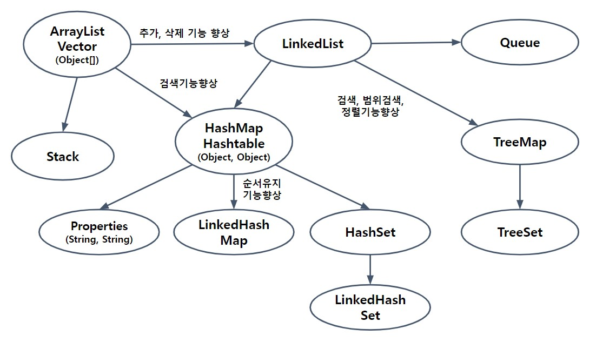

# 컬렉션 프레임워크 1-6

### 1.12 Properties
: **Properties**는 HashMap의 구버전인 Hashtable을 상속받아 구현한 것으로,
Hashtable은 키와 값을 (Object, Object)의 형태로 저장하는데 비해
Properties는 **(String, String)** 의 형태로 저장하는 보다 단순화된 컬렉션 클래스이다.

주로 애플리케이션의 환경설정과 관련된 속성(property)을 저장하는데 사용되며
데이터를 파일로부터 읽고 쓰는 편리한 기능을 제공한다.
그래서 간단한 입출력은 Properties를 활용하면 몇 줄의 코드로 쉽게 해결 가능

| 메서드                                                               | 설명                                                                       |
|-------------------------------------------------------------------|--------------------------------------------------------------------------|
| Properties()                                                      | Properties객체를 생성                                                         |
| Properties(Properties defaults)                                   | 지정된 Properties에 저장된 목록을 가진 Properties 객체를 생성                             |
| String getProperty(String key)                                    | 지정된 키(key)의 값(value)을 반환                                                 |
| String getProperty(String key, String defaultValue)               | 지정된 키(key)의 값(value)을 반환. 키를 못찾으면 defaultValue를 반환                       |
| void list(PrintStream out)                                        | 지정된 PrintStream에 저장된 목록을 출력                                              |
| void list(PrintWrtier out)                                        | 지정된 PrintWriter에 저장된 목록을 출력                                              |
| void load(InputStream inStream)                                   | 지정된 InputStream으로부터 목록을 읽어서 저장                                           |
| void load(Reader reader)                                          | 지정된 Reader으로부터 목록을 읽어서 저장                                                |
| void loadFromXML(InputStream in)                                  | 지정된 InputStream으로부터 XML문서를 읽어서, XML 문서에 저장된 목록을 읽어다 담는다(load & store)    |
| Enumeration propertyNames()                                       | 목록의 모든 키(key)가 담긴 Enumeration을 반환                                        |
| void save(OutputStream out, String header)                        | deprecated되었으므로 store()를 사용                                              |
| Object setProperty(String key, String value)                      | 지정된 키와 값을 저장. 이미 존재하는 키(key)면 새로운 값(value)로 바뀐다                          |
| void store(OutputStream out, String comments)                     | 저장된 목록을 지정된 OutputStream에 출력(저장)한다. <br/>comments는 목록에 대한 주석으로 저장됨       |
| void store(Writer writer, String comments)                        | 저장된 목록을 지정된 Writer에 출력(저장)한다. <br/>comments는 목록에 대한 설명(주석)으로 저장됨         |
| void storeToXML(OutputStream os, String comment)                  | 저장된 목록을 지정된 출력스트림에 XML문서로 출력(저장)한다.<br/>comment는 목록에 대한 설명(주석)으로 저장됨     |
| void storeToXML(OutputStream os, String comment, String encoding) | 저장된 목록을 지정된 출력스트림에 해당 인코딩의 XML문서로 출력(저장)한다. comment는 목록에 대한 설명(주석)으로 저장됨 |
| Set stringPropertyNames()                                         | Properties에 저장되어 있는 모든 키(key)를 Set에 담아서 반환한다.                            |


### 1.13 Collections
: Arrays가 배열과 관련된 메서드를 제공하는 것처럼, 
Collections는 컬렉션과 관련된 메서드를 제공한다.
fill(), copy(), sort(), binarySearch() 등의 메서드는 두 클래스에 모두 포함되어 있으며 같은 기능을 한다.

#### 컬렉션의 동기화
: 멀티 쓰레드 프로그래밍에서는 하나의 객체를 여러 쓰레드가 동시에 접근할 수 있기 때문에
데이터의 일관성을 유지하기 위해서는 공유되는 객체에 **동기화**가 필요하다.

ArrayList와 HashMap과 같은 컬렉션은 동기화를 자체적으로 처리하지 않고 필요한 경우에만
java.util.Collections클래스의 동기화 메서드를 이용해서 동기화처리가 가능하도록 변경하였다.

```
List syncList = Collections.synchronizedList(new ArrayList(...));
```

#### 변경불가 컬렉션 만들기
: 컬렉션에 저장된 데이터를 보호하기 위해서 컬렉션을 변경할 수 없게, 즉 읽기전용으로 만들어야 할 때가 있다.
주로 멀티 쓰레드 프로그래밍에서 여러 쓰레드가 하나의 컬렉션을 공유하다보면 데이터가 손상될 수 있는데,
이를 방지하려면 아래의 메서드를 이용한다.

```
static Collection unmodifiableCollection(Collection c)
static List unmodifiableList(List list)
static Set unmodifiableSet(Set s)
static Map unmodifiableMap(Map m)
static NavigableSet unmodifiableNavigableSet(NavigableSet s)
static SortedSet unmodifiableSortedSet(SortedSet s)
static NavigableMap unmodifiableNavigableMap(NavigableMap m)
static SortedMap unmodifiableSortedMap(SortedMap m)
```

#### 싱글톤 컬렉션 만들기
: 단 하나의 객체만을 저장하는 컬렉션을 만들고 싶을 때 사용하는 메서드
<br>매개변수로 저장할 요소를 지정하면, 해당 요소를 저장하는 컬렉션을 반환한다.
그리고 반환된 컬렉션은 변경할 수 없다.

```
static List singletonList(Object o)
static Set singleton(Object o)
static Map singletonMap(Object key, Object value)
```

#### 한 종류의 객체만 저장하는 컬렉션 만들기
: 대부분의 경우 한 종류의 객체를 저장하며, 컬렉션에 지정된 종류의 객체만 저장할 수 있도록
제한하고 싶을 때 사용하는 메서드

```
static Collection checkedCollection(Collection c, Class type)
static List checkedList(List list, Class type)
static Set checkedSet(Set s, Class type)
static Map checkedMap(Map m, Class keyType, Class valueType)
static Queue checkedQueue(Queue queue, Class type)
static NavigableSet checkedNavigableSet(NavigableSet s, Class type)
static SortedSet checkedSortedSet(SortedSet s, Class type)
static NavigableMap checkedNavigableMap(NavigableMap m, Class keyType, Class valueType)
static SortedMap checkedSortedMap(SortedMap m, Class keyType, Class valueType)
```

### 1.14 컬렉션 클래스 정리 & 요약



| 컬렉션                             | 특징                                                                          |
|---------------------------------|-----------------------------------------------------------------------------|
| ArrayList                       | 배열기반, 데이터의 추가와 삭제에 불리, 순차적인 추가삭제는 제일 빠름. 임의의 요소에 대한 접근성(accessibility)이 뛰어남 |
| LinkedList                      | 연결기반. 데이터의 추가와 삭제에 유리. 임의의 요소에 대한 접근성이 좋지 않다                                |
| HashMap                         | 배열과 연결이 결합된 형태. 추가, 삭제, 검색, 접근성이 모두 뛰어남. 검색에는 최고성능                          |
| TreeMap                         | 연결기반. 정렬과 검색(특히 범위검색)에 적합. 검색 성능은 HashMap보다 떨어진다                            |
| Stack                           | Vector를 상속받아 구현                                                             |
| Queue                           | LinkedList가 Queue인터페이스를 구현                                                  |
| Properties                      | Hashtable을 상속받아 구현                                                          |
| HashSet                         | HashMap을 이용해서 구현                                                            |
| TreeSet                         | TreeMap을 이용해서 구현                                                            |
| LinkdeHashMap<br/>LinkedHashSet | HashMap과 HashSet에 저장순서 유지기능을 추가                                             |