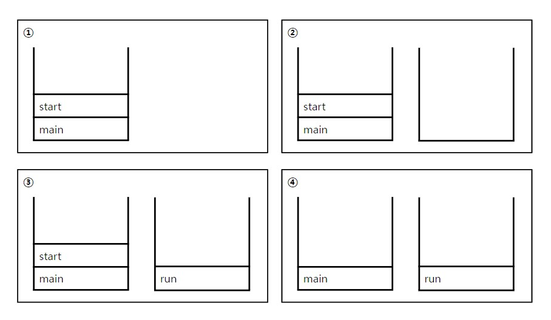
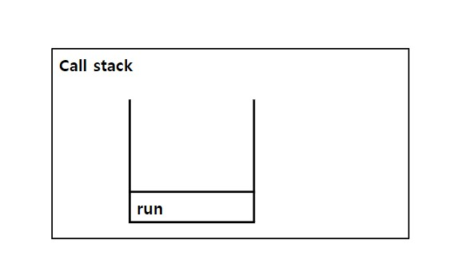

# 쓰레드(thread)

### 1. 프로세스와 쓰레드
: **프로세스(process)** 란 '실행 중인 프로그램(program)'이다.
프로그램을 실행하면 OS로부터 실행에 필요한 자원(메모리)을 할당받아 프로세스가 된다.

프로세스는 프로그램을 수행하는데 필요한 데이터와 메모리 등의 자원 그리고 쓰레드로 구성되어 있으며
프로세스의 자원을 이용해서 실제로 작업을 수행하는 것이 **쓰레드**이다.

모든 프로세스에는 최소한 하나 이상의 쓰레드가 존재하며,
둘 이상의 쓰레드를 가진 프로세스를 **'멀티쓰레드 프로세스(multi-threaded process)'** 라고 한다.

<br>

#### 멀티태스킹과 멀티쓰레딩
: 대부분의 OS는 멀티태스킹(multi-tasking, 다중작업)을 지원하기 때문에
여러 개의 프로세스가 동시에 실행될 수 있다.
이와 마찬가지로 멀티쓰레딩은 하나의 프로세스 내에서 여러 쓰레드가 동시에 작업을 수행하는 것이다.


#### 멀티쓰레딩의 장단점
- 멀티쓰레딩의 장점
  - CPU의 사용률을 향상시킨다.
  - 자원을 보다 효율적으로 사용할 수 있다.
  - 사용자에 대한 응답성이 향상된다.
  - 작업이 분리되어 코드가 간결해진다.

메신저로 채팅하면서 파일을 다운로드 받거나 음성대화를 나눌 수 있는 것이 가능한 이유 <br>
→ 멀티쓰레드로 작성되어 있기 때문, 싱글쓰레드로 작성되어 있다면 불가능


### 2. 쓰레드의 구현과 실행
: 쓰레드를 구현하는 방법
1. Thread클래스를 상속받는 방법
2. Runnable인터페이스를 구현하는 방법

→ Thread클래스를 상속받으면 다른 클래스를 상속받을 수 없기 때문에
**Runnable인터페이스**를 구현하는 방법이 일반적이고,
재사용성이 높고 코드의 일관성을 유지할 수 있기 때문에 보다 **객체지향적인 방법**

- Thread클래스를 상속 <br>
: Thread클래스를 상속받으면, 자손 클래스에서 조상인 Thread클래스의 메서드를 직접 호출할 수 있지만
Runnable을 구현하면 Thread클래스의 static메서드인 currentThread()를 호출하여 쓰레드에 대한
참조를 얻어와야만 호출이 가능
```
class MyThread extends Thread
    public void run() { /* 작업 내용 */ }   // Thread클래스의 run()을 오버라이딩
}
```

> **static Thread currentThread()** : 현재 실행중인 쓰레드의 참조를 반환
> <br>
> **String getName()** : 쓰레드의 이름을 반환

- Runnable인터페이스를 구현 <br>
: Runnable인터페이스를 구현한 클래스의 인스턴스를 생성한 다음,
이 인스턴스를 Thread클래스의 생성자의 매개변수로 제공해야 함. <br>
run()을 호출하면 Runnable인터페이스를 구현한 인스턴스의 run()이 호출되고, 
run()을 오버라이딩하지 않고 제공받을 수 있다.
```
class MyThread implements Runnable {
    public void run() { /* 작업 내용 */ }   // Runnable인터페이스의 run()을 구현
}
```

#### 쓰레드의 실행 - start()
: start()를 호출해야 쓰레드가 실행된다.
<br> 호출되었다고 바로 실행되는 것이 아니라, 일단 실행대기 상태에서 자신의 차례가 되어야 실행된다.

```
t1.start();   // 쓰레드 t1을 실행
t2.start();   // 쓰레드 t2를 실행
```

한 번 실행이 종료된 쓰레드는 다시 실행할 수 없다.
즉, 하나의 쓰레드에 대해 start()가 한 번만 호출될 수 있다.

그래서 쓰레드의 작업을 한 번 더 수행해야 한다면, 새로운 쓰레드를 생성한 다음에 start()를 호출해야 한다.

### 3. start()와 run()
- main메서드에서 run()을 호출 : 생성된 쓰레드를 실행시키는 것이 아니라 단순히 클래스에 선언된 메서드를 호출하는 것
- start() : 새로운 쓰레드가 작업을 실행하는데 필요한 호출스택(call stack)을 생성한 다음에 run()을 호출해서
생성된 호출스택에 run()이 첫 번째로 올라가게 한다.


1. main메서드에서 쓰레드의 start()를 호출한다.
2. start()는 새로운 쓰레드를 생성하고, 쓰레드가 작업하는데 사용될 호출스택을 생성
3. 새로 생성된 호출스택에 run()이 호출되어, 쓰레드가 독립된 공간에서 작업을 수행
4. 이제는 호출스택이 2개이므로 스케줄러가 정한 순서에 의해서 번갈아가면서 실행


#### main쓰레드
: main메서드의 작업을 수행하는 것도 쓰레드이며, 이를 main쓰레드라고 한다.
프로그램을 실행하면 기본적으로 하나의 쓰레드를 생성하고, 그 쓰레드가 main메서드를 호출해서 작업이 수행되도록 하는 것이다.

** main메서드가 종료된 후의 호출스택 <br>


main메서드가 수행을 마치면 프로그램이 종료되었으나, 그림과 같이 main메서드가 수행을 마쳤다하더라도
다른 쓰레드가 아직 작업을 마치지 않은 상태라면 프로그램이 종료되지 않는다.